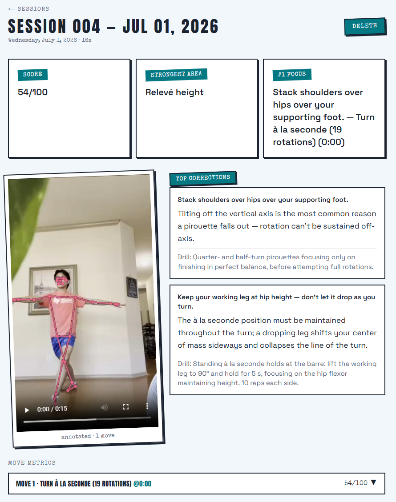
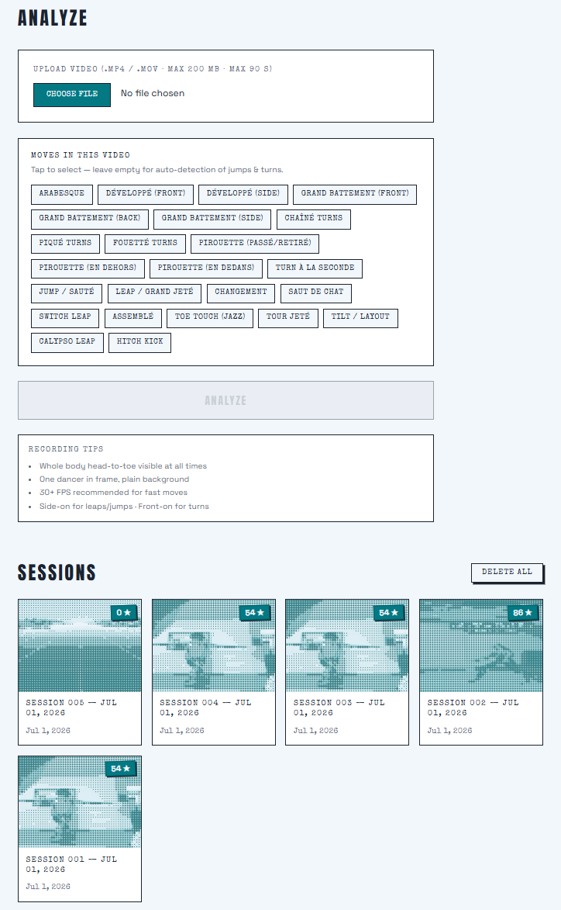

# Dance Technique Analysis Platform

## About this project
This project analyzes dance videos and provides targeted feedback to dancers on how to improve their technique. As a dancer and teacher, I love to share my passion for dance. But at my dance studio, only certain kids can take private classes because they're so expensive. I wanted to create a tool that gives any kid the same one-on-one feedback that private classes provide, that's why build it.

## How it works
The app uses MediaPipe to track the dancer's body, letting the computer measure the angles their joints form throughout the video. It detects technique moves (jumps, leaps, and turns), scores each one against technique-based thresholds, and returns matching coaching corrections including what to fix, why it matters, and a drill to practice it. These critiques, alongside a compliment highlighting the dancer's strongest area, are shown around the MediaPipe-annotated video.

## Screenshots

## Tech stack
- **Frontend:** Next.js, React, Tailwind CSS
- **Backend:** Python, FastAPI
- **Pose estimation & analysis:** MediaPipe, OpenCV, NumPy
- **Database, auth & storage:** Supabase (Postgres)
- **Video encoding:** ffmpeg

## Status
I have big goals for this project! I'm currently building live coaching using generative AI and text-to-speech. After that, I'll add a section where dancers can learn from scratch, so no previous experience is needed to use the app — similar to Duolingo, where users learn and then get tested. Finally, I'll wrap it as a mobile app for the App Store and get it hosted online.

## Setup
The app currently runs locally (a hosted version is coming by mid-August). It uses a Next.js frontend, a FastAPI backend, and Supabase for auth and storage — running it yourself requires your own free Supabase project.

**Prerequisites:** Node.js, Python 3.10+, ffmpeg, and a Supabase project.

1. **Backend:** `cd backend` → `pip install -r requirements.txt` → add your Supabase keys to `backend/.env` (see `backend/.env.example`) → `uvicorn main:app --reload`
2. **Frontend:** `cd frontend` → `npm install` → add your keys to `frontend/.env.local` (see `frontend/.env.example`) → `npm run dev`
3. Open http://localhost:3000

Full Supabase setup steps (tables, storage buckets, Google OAuth) are in [ROADMAP.md](./ROADMAP.md).